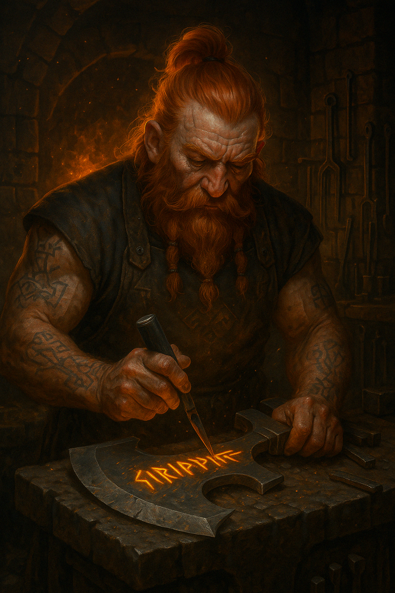
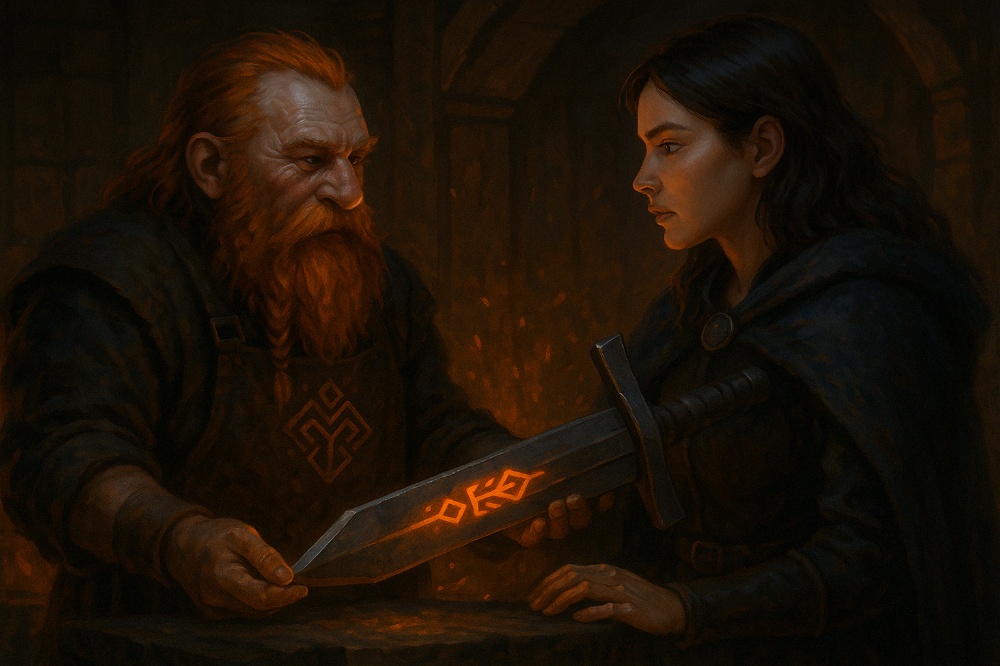

# Runedur

A C# ORM that only exists at build time as it uses code generation.

## 📜 Why “Runedur”?

_Runedur_ is named for a mythical dwarven smith — a silent builder who inscribes native code into stone and vanishes before the fire cools.

Like its namesake, this project exists only during build time. It forges fully idiomatic C# code using Roslyn source generators, leaving no trace at runtime. No runtime reflection, no magic - just clean, crafted types that feel like you wrote them by hand.

The name comes from two parts:

- _Rune_ - evoking precision, inscription, and ancient symbolic logic
- _Dur_ - inspired by dwarvish naming traditions (Khazad-dûm, Barad-dûr), conveying strength, stoicism, and deep craft.

Runedur is the codewright who works behind the scenes — the last forger your project will need.

## Who is Runedur?

Runedur, is the dwarf master of the forge you hire to help prepare equipment for your hero, before you send them on their adventure.

He does his work before the adventure starts (i.e. at build time).

The hero (your application) then embarks on her adventure in the world.

