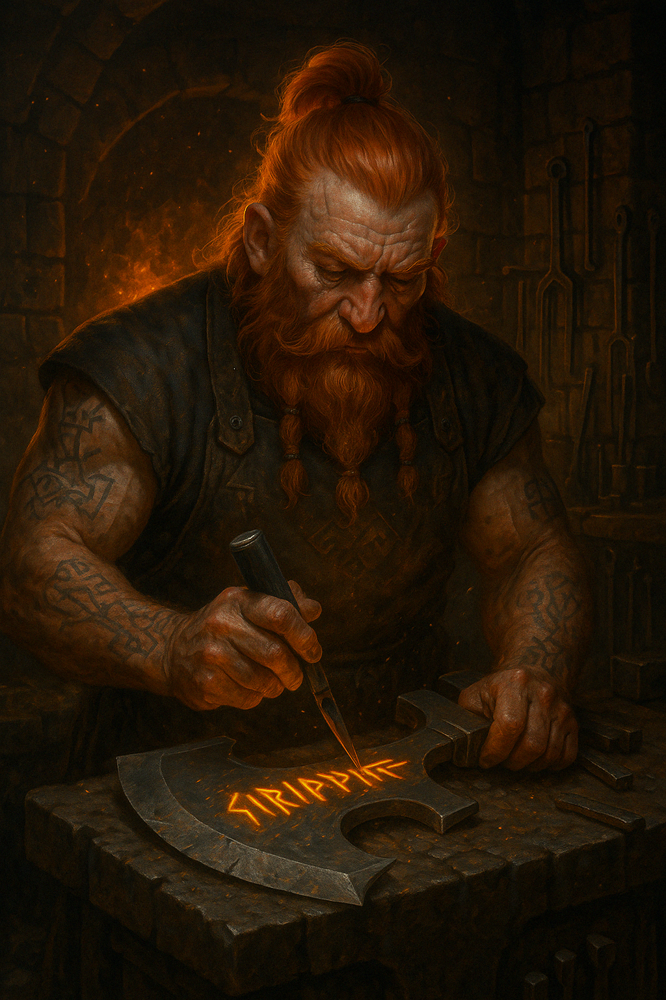
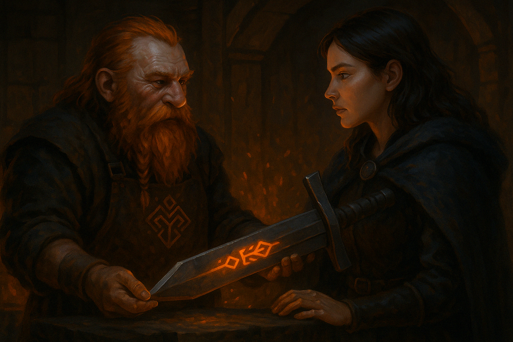

# 📖 The Lore of Runedur

> *“He does not walk with heroes. He prepares them.”*

In the quiet glow of a forge deep beneath the stone, **Runedur** works alone.  
He is a smith of code and craft — a master builder whose tools are **runes and flame**, and whose work is **never seen at runtime**.

His art is not for spectacle, nor for praise.  
It is for **function**, **elegance**, and **immutability**.

## 🧙 The Codewright

Runedur is no ordinary blacksmith. He inscribes **C# code** into the world —  
perfect types, strong relationships, and pure constructs, all formed during the **build**.

- His **hammer**: Roslyn source generators.
- His **anvil**: your project’s model definitions.
- His **craft**: generating clean, runtime-free, idiomatic C# that feels like it was written by hand.

When your app begins, **he is already gone** - only the shapes he forged remain.

## ⚔️ The Hero’s Journey

She arrives with nothing but a name.

Through the heat and echo of the forge, she steps forward —  
and receives a **rune-etched sword**, glowing with silent promises of structure, reliability, and strength.

Runedur says nothing. He only nods once, and returns to the emberlit anvil.

## 🧱 The Ethos

> *“Write what must be written — once.”*

Runedur believes in:
- Simplicity over cleverness
- Performance over reflection
- Compile-time over runtime
- Empowering developers with tools that **disappear when they’re no longer needed**

His work lives in the seams of your system — out of sight, but never out of mind.

## 🔥 The Legacy

The world may never know his name, but his symbols are etched into every runtime artifact your system uses. A silent sentinel, embedded in the build — a whisper of fire and rune.

> And when the next hero comes?  
> The forge will be ready.

